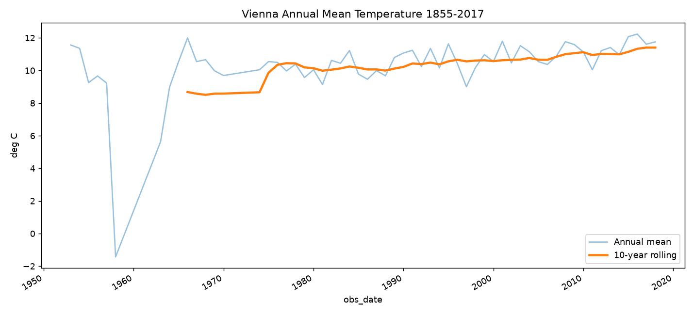
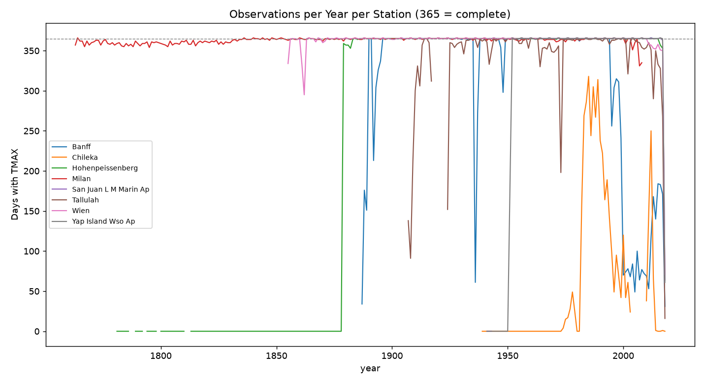
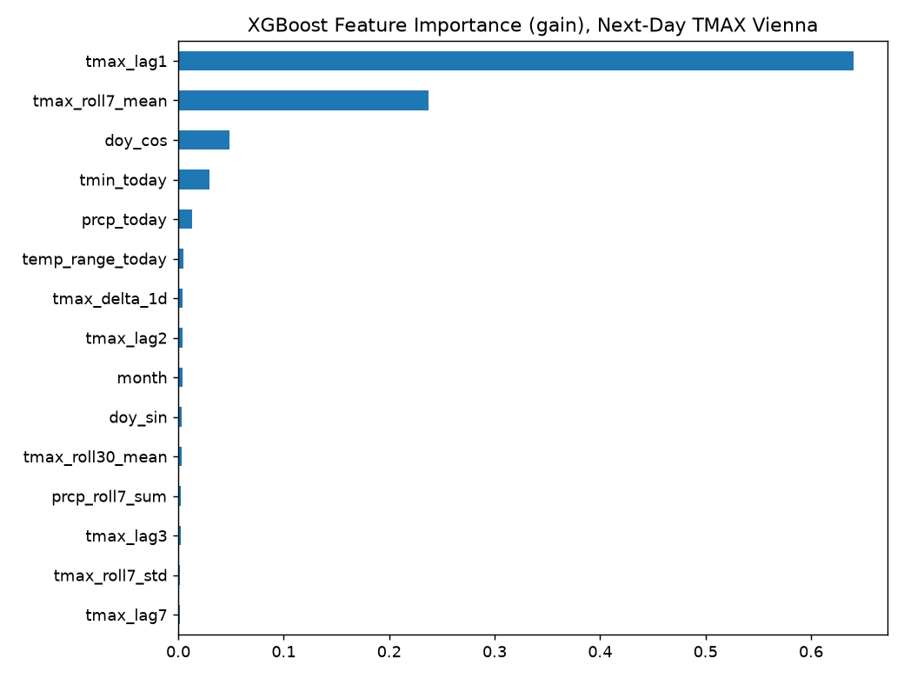
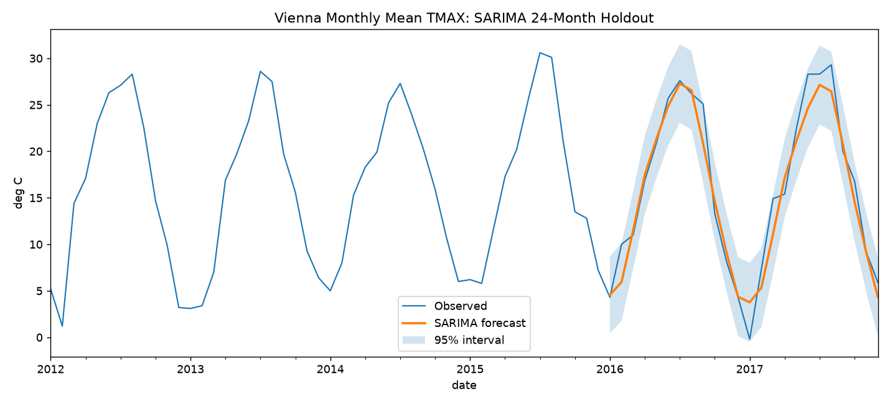

# WeatherIntel — Global Weather Analytics & Forecast Evaluation

A weather intelligence platform built from real NOAA station records: eight stations, four continents, up to 255 years of daily observations, turned into an auditable star-schema warehouse, a set of forecasting models benchmarked against each other, and a Power BI layer on top.

Every value in this project is an actual instrument reading, complete with NOAA's own quality flags. Nothing here is synthetic.

## Why this exists

Weather-dependent industries — agriculture, aviation, insurance, logistics, renewable energy, public-sector planning — need historical weather data they can actually trust and query. Raw archives like NOAA's GHCN-Daily aren't analysis-ready: they mix missing values, quality flags, and stations with wildly different histories and coverage gaps. This project builds the layer between the raw archive and a decision-maker's dashboard, and it keeps the data-quality problems visible instead of hiding them.

## Architecture

```text
NOAA GHCN-Daily (.dly bronze files)
        │
        ▼
pipeline/parse_and_stage.py   — parsing, unit conversion, staging
        │
        ▼
Long audit fact (staging/fact_observations_long.csv)
        │
        ▼
sql/03_quality_audit.sql      — NOAA QA flag filtering
        │
        ▼
Curated daily fact (staging/fact_daily_weather.csv)
        │
        ▼
sql/01_schema.sql + load_postgres.py   — PostgreSQL star schema
        │
        ▼
Power BI  →  Executive Overview + Forecast Model Performance
```

The long and wide facts are kept deliberately separate: the long fact preserves NOAA's native grain and every quality flag for auditability, the wide fact is what analysts and Power BI actually query day to day.

## The 8 stations

Chosen for contrast, not convenience: different climates, different histories, different problems with the data.

| Station | Country | Climate | History | Why it's here |
|---|---|---|---|---|
| Wien (Vienna) | Austria | Humid continental | 1855–2018 | GSN flagship, 99% complete — the clean baseline for model training |
| Hohenpeissenberg | Germany | Temperate mountain | 1781–2017 | One of the oldest observatories on Earth — long-run climate trend |
| Milan | Italy | Humid subtropical | 1763–2008 | 245 years of history, then the station stops — tests handling of discontinued sources |
| Banff | Canada | Subarctic mountain | 1887–2018 | Heavy snowfall and real coverage gaps — logistics/insurance angle |
| Tallulah | USA (Louisiana) | Humid subtropical | 1907–2018 | Mississippi Delta agriculture — rainfall and frost relevant to crops |
| San Juan LMM Airport | Puerto Rico | Tropical monsoon | 1956–2018 | Hurricane exposure — aviation and insurance extreme events |
| Yap Island Airport | Micronesia | Tropical rainforest | 1951–2018 | 100% complete tropical Pacific record — typhoon region |
| Chileka | Malawi | Tropical savanna | 1939–2018 | ~20% coverage after 1990 — honest, unglamorous data-quality work |

Five of the eight are GSN stations, part of the WMO's flagship global climate monitoring network.

## Analysis highlights

**Vienna is warming.** The 10-year rolling mean climbs from roughly 8.6°C in the late 1960s to 11.4°C in the most recent decade — over 2.5°C of rise across the record.



**Coverage is not uniform, and that matters.** Banff, Chileka and Tallulah all have multi-year stretches with far fewer than 365 observed days — a reminder that gaps have to be handled explicitly, not averaged away.



**Next-day temperature forecasting: XGBoost beats the naive baselines.**

| Model | MAE (°C) | RMSE (°C) |
|---|---|---|
| Climatology | 3.89 | 4.81 |
| Persistence | 2.33 | 2.97 |
| Linear Regression | 2.25 | 2.81 |
| **XGBoost** | **2.22** | **2.80** |

XGBoost's next-day TMAX forecast is driven almost entirely by yesterday's temperature and a 7-day rolling mean — seasonality and rainfall contribute far less, which is exactly what you'd expect from weather persistence and is a useful sanity check on the model.



A SARIMA model on Vienna's monthly series holds up well over a 24-month holdout: it follows the seasonal swing closely, with a tight confidence interval.



## Dataset

- **8 weather stations**, 4 continents
- **371,482** curated station-day rows
- **1,404,997** core observation rows in the long audit fact
- **93,212** calendar dates
- **10** weather elements (TMAX, TMIN, TAVG, PRCP, SNOW, SNWD, AWND, WSFG, WDFG, TSUN)
- Coverage from **1763 to March 2018**, depending on station

## Data quality, kept visible

Across all non-missing observations in the raw `.dly` snapshot, **9,558** carry a NOAA quality-failure flag. Within the core elements retained in the audit fact, that's **1,587** flagged observations. Q-flagged values are excluded from the curated `fact_daily_weather` layer but kept in the long audit fact — nothing is silently dropped.

## Star schema

```text
                 dim_date
                     │
Dim_Station ── fact_daily_weather        ← analysis layer (silver)
                     
dim_station ── fact_weather_observations ── dim_element   ← audit layer (bronze)
```

- **dim_station** (8 rows) — station id, name, country, lat/lon, elevation, GSN flag, climate zone
- **dim_date** (93,212 rows) — calendar attributes, Northern Hemisphere season
- **dim_element** (10 rows) — GHCN element code, description, unit
- **fact_weather_observations** — long grain (station, date, element), value + NOAA measurement/quality/source flags — the audit layer
- **fact_daily_weather** — wide grain (station, date), QA-failed values excluded — the analysis layer Power BI actually consumes

Analytical views (`sql/04_analysis_layer.sql`) add daily and monthly summaries on top.

## Important limitations (read before you trust a number)

- **This is a historical snapshot, not a live feed.** It ends in March 2018 for most stations. See [Refreshing the data](#refreshing-the-data) below to pull current data.
- **Coverage varies a lot by station.** Missing observations must never be read as "zero weather" — see the coverage chart above.
- **`season_nh` is Northern Hemisphere seasonality.** Chileka (Malawi) is in the Southern Hemisphere, so any local-season analysis needs to be station-aware.
- **Forecast numbers are holdout results, not guarantees.** Read them against their evaluation period and baseline, not as a promise about tomorrow's weather anywhere else.

## Refreshing the data

The pipeline works on both the historical `.dly` files bundled here and NOAA's current by-station CSV format, so it's genuinely re-runnable, not a one-off snapshot:

```bash
python pipeline/refresh_ghcn_noaa.py       # pull each station's latest history from NOAA's AWS Open Data mirror
python pipeline/parse_and_stage.py         # parse raw files, convert units, write staging CSVs
psql -d weatherintel -f sql/01_schema.sql  # create the PostgreSQL star schema
python pipeline/load_postgres.py           # bulk-load staging CSVs via COPY
psql -d weatherintel -f sql/03_quality_audit.sql   # NOAA QA flag reporting
psql -d weatherintel -f sql/04_analysis_layer.sql  # daily/monthly analysis views
```

`pipeline/fetch_openmeteo_supplement.py` adds solar, humidity and pressure variables from Open-Meteo's ERA5 archive for stations that want it.

## Repository structure

```text
README.md
sql/                    schema, QA filtering, analysis views (PostgreSQL)
pipeline/               ingestion, staging, loading, and modelling scripts
  pipeline/             EDA, feature engineering, baseline/SARIMA/XGBoost models
raw/data/                original NOAA .dly and .csv station files (bronze, untouched)
staging/                 parsed, staged CSVs ready to load (dim + fact tables)
outputs/                 model results and the charts above
weather intel.pbix       Power BI report: Executive Overview + Forecast Model Performance
```

`weatherintel.db`, the built PostgreSQL warehouse and the Python virtual environment are not included in this repository — rebuild locally with the commands above.

## Tech stack

Python (pandas), PostgreSQL, SQL, statsmodels (SARIMA), XGBoost, scikit-learn, Power BI / DAX.

## Source

NOAA Global Historical Climatology Network-Daily (GHCN-Daily):

> Menne, M.J., I. Durre, R.S. Vose, B.E. Gleason, and T.G. Houston, 2012: An overview of the Global Historical Climatology Network-Daily Database. *Journal of Atmospheric and Oceanic Technology*, 29, 897-910.

## License

MIT — see [LICENSE](LICENSE).
